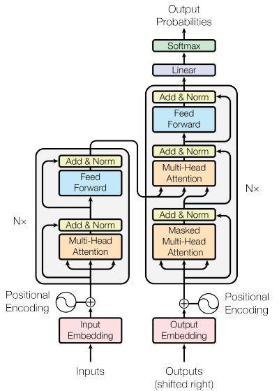

# Introduction
------------
RNN, LSTM, GRN은 언어 모델링 및 기계 번역과 같은 시퀀스 모델링 및 변환 문제에서 자주 사용되었다. 이러한 모델들은 순차적으로 계산한다는 점으로 인해 Long-term Dependency Problem이라는 초기 입력 정보가 망각된다는 현상이 발생한다.

기존의 연구에선 Attention 메커니즘을 이용하여 거리에 입력 또는 출력 시퀀스 내의 거리에 상관없이 학습을 할 수 있도록하여 이러한 문제를 해결하였다. 대부분의 기존 연구에선 순환 네트워크와 Attention 메커니즘을 결합하여 사용하였다.

이 논문에선 순환을 피하고 입출력 사이의 global dependencies를 위해 Attention에만 의존하는 모델 구조인 Transformer를 제안한다.

# Background
------------
CNN을 이용한 경우 입출력 사이의 신호를 연관시키는데 필요한 연산 수는 위치 간의 거리에 따라 증가한다. 이는 멀리 떨어진 위치 사이의 의존성을 학습하는 것을 더 어렵게 만든다.

intra-attention이라 불리는 Self-attention 경우 단일 시퀀스의 서로 다른 위치들을 연관 시키는 attention 메커니즘이다. Self-attention은 다양한 작업에서 성공적으로 사용되었다.

# Model Architecture
------------
대부분의 신경망 시퀀스 변환 모델은 encoder-decoder 구조를 가진다. encoder는 입력 시퀀스를 연속적인 표현의 시퀀스 $z$로 매핑한다.
